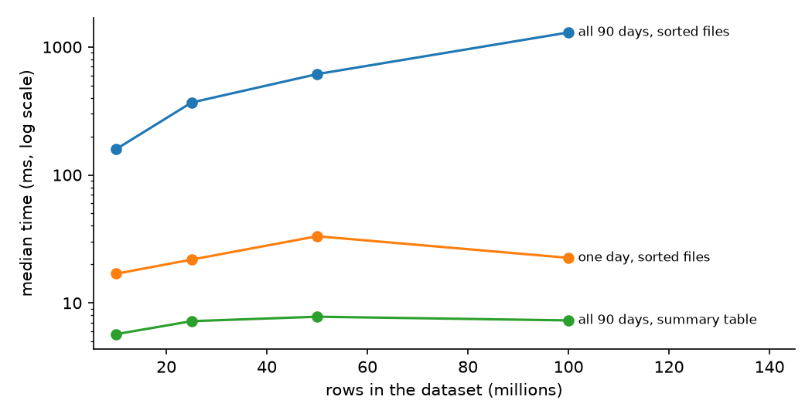

# log-scaling

## The task

> You are ingesting 5M+ rows a day, around 1B rows over a 90 day window. How would you handle
> analytical and agent queries at that scale efficiently? Back it with experimental code.

## My answer, in five lines

1. 1B rows in 90 days is about 130 rows a second and tens of GB. That is medium data. It does not
   need a cluster, it needs a good file layout.
2. Raw data arrives as CSV. Clean it once a day into **one sorted Parquet file per day**.
3. Keep **small summary tables** for the questions that get asked again and again.
4. Give the agent **one guarded query tool**, never direct access to the engine.
5. Do not embed event rows into a vector store. Counting is a SQL job.

Everything below is measured by the code in this repo, on a laptop, and can be re-run.

## How to run it

Needs [uv](https://docs.astral.sh/uv/). No Docker, no cloud account.

    uv sync
    uv run python -m logscale all

About ten minutes. It makes the data, runs every test below, and rewrites the numbers in this file.
`uv run pytest` runs the 100 tests. Single steps are listed at the bottom.

## What I assumed

The brief does not say what a row is, so I picked the most likely shape and wrote it down.

| I assumed | If that is wrong |
|---|---|
| Rows are events: written once, never edited | Data that gets edited belongs in PostgreSQL, not in files |
| Every row has a time, and most questions have a date range | Without date ranges, one-file-per-day stops helping |
| Questions are mostly counts, top-N and comparisons | For free-text search, a search engine fits better |
| A few minutes of delay is fine | Second-level freshness needs a streaming path on top |
| Device events are only an example | Payments or orders have the same shape: a time, an id, a few categories, a status, a number |

The brief's two numbers do not match (5M x 90 days = 450M, not 1B). I sized for the bigger one,
about 11M rows a day.

## What I did

    Devices send events                       (generate: fake devices, one planted incident)
          |
    Raw CSV arrives, kept as it is            (never edited, so any day can be rebuilt)
          |
    Clean it once a day                       (ingest: set types, drop repeats, sort, compress)
          |
    One sorted file per day
          |                     \
    Small summary tables         Detail questions
    (known questions)            (read only the days and columns needed)
          |                     /
    Dashboards and the agent's guarded query tool

To prove the layout matters, I stored the **same rows six different ways** and asked all of them
the **same seven questions**. The data has one planted incident (one device model, on one OS, fails
40% of the time on one day), so there is a known right answer to find.

DuckDB stands in for Athena. Both read Parquet with SQL and skip data the same way. I had no cloud
access, so the claim is about the layout, not about one engine matching the other's speed.

## How I judged the options

1. How fast does the answer come back?
2. How much data had to be read? On pay-per-scan engines this is the bill.
3. How much disk does it take?
4. How easy is it to fix one bad day?
5. Does it stay fast when the data grows 10x?

## Results

<!-- results:start -->

_Measured on: Windows-11-10.0.26200-SP0, 8 logical CPUs, DuckDB 1.5.5, Python 3.12.2. Timings are the median of 7 warm runs (3 for csv)._

#### The same 9,999,990 rows, stored six ways

| Way of storing | Disk | "Failures on one day" | "Fail rate by model, all 90 days" | Data read for the 90 day question | Verdict |
|---|---|---|---|---|---|
| Raw CSV, as it arrives | 1,606.6 MB | 4,798.7 ms | 4,221.1 ms | 1,606.61 MB | Keep only as the untouched original |
| One big file | 179.6 MB | 14.3 ms | 170.2 ms | 8.52 MB | Fast, but fixing one day means rewriting everything |
| One file per day | 177.8 MB | 17.6 ms | 213.9 ms | 8.52 MB | Good |
| **One file per day, sorted** | 172.8 MB | 16.9 ms | 159.1 ms | 3.84 MB | **Chosen** |
| Thousands of tiny files | 235.5 MB | 490.8 ms | 1,820.3 ms | 10.84 MB | What to avoid: same data, far slower |
| Summary tables | 0.3 MB | 2.4 ms | 5.7 ms | 0.15 MB | Used for the known questions |

#### Does sorting matter? At real volume, 5M rows a day

| Question | One file per day | One file per day, sorted |
|---|---|---|
| How many different devices hit error 1042 this week? | 125.9 ms, 33.36 MB read | 15.7 ms, 1.16 MB read |
| Last 100 events of one device in the past 30 days | 301.9 ms, 80.55 MB read | 50.9 ms, 8.3 MB read |
| How many events failed on one given day? | 26.9 ms, 0.39 MB read | 9.0 ms, under 0.01 MB read |

#### What happens when the data grows

| Rows | Scan all 90 days | Ask about one day | Ask the summary table |
|---|---|---|---|
| 10 million | 159.1 ms | 16.9 ms | 5.7 ms |
| 100 million | 1,298.1 ms | 22.5 ms | 7.3 ms |
| 1 billion (projected, not measured) | about 13 s | tens of ms | unchanged |

The last line is a straight-line projection from the measured runs. At that size the sorted files would take about 16 GB, and the 90 day scan would read about 373 MB, around $1.87 per 1,000 such queries on a pay-per-scan engine. This is why the agent is not allowed to scan all 90 days.

#### Other measured facts

- The daily job turns a 5,005,000 row raw `csv.gz` into a cleaned, sorted file in **16.9 to 20.8 seconds** on a laptop, and dropped 5,000 re-sent events on the way.
- A question that digs inside the JSON text: 27.0 ms, 1.04 MB read. Same question on a proper column: **18.5 ms, 0.14 MB read**.
- Approximate unique counts were off by 1.16% over all days, 7.65% over one week, 14.34% over one day. Fine for a long window, not for a short one.
- Adding up 7 daily unique counts gives 41,262. The true weekly number is 38,373. That is 7.5% too high, so unique counts cannot come from daily summaries.
- The agent tool refused **7 of 12** query attempts, each with a reason, and found the planted incident: **KR-20 on win11, "update download failed", 823 failures**.

Every table behind these numbers is in [RESULTS.md](RESULTS.md).

<!-- results:end -->

## Design decisions

**One sorted Parquet file per day.**
Why: smallest on disk, fastest at real volume, and a bad day can be replaced without touching the
other 89. What I gave up: sorting did nothing at small volume, it only pays once a day's file is big.

**Per day, not per hour.**
Why: a day is a comfortable file size. Hourly files would be tiny, and tiny files were the slowest
thing I measured. What I gave up: a question about one hour still opens the whole day.

**Summary tables for known questions.**
Why: they stay at a few milliseconds while a full scan grows with the data. What I gave up: they only
answer questions I planned for, and "unique devices" cannot be summed across days, so that one
still goes to the detail files.

**Popular JSON fields become real columns.**
Why: faster and about a tenth of the data read. What I gave up: one more step in the daily job. The
raw JSON is kept too.

**Exact unique counts for short windows, approximate only for very long ones.**
Why: the approximate count was up to 14% off on a single day. What I gave up: nothing, short windows
are fast anyway.

**The agent gets one guarded tool, with rules in code.**
Read only, approved tables, no `SELECT *` on the big table, a date range of at most 31 days, a row
limit, a scan budget, a timeout. The SQL is parsed into a tree and checked, because a text search
for "DELETE" is easy to get around. A refusal comes back as a sentence the model can act on. What I
gave up: the tool does not rewrite queries for the model, it tells the model what to fix.

**Python only gives orders.**
The engine does the row work in C++ on all cores, and memory is capped so an 8 GB laptop survives.
That is why there is no multiprocessing, threading or PyPy here: they speed up Python that does
the heavy lifting, and this Python does none.

## Alternatives I did not pick

| Option | Why not |
|---|---|
| PostgreSQL for everything | Row storage reads whole rows to count one column, needs far more disk, and cannot have an index for every question an agent invents. It stays in the design for summaries and edited data. Not measured here, it is the next thing I would test |
| Spark / Glue | A few hundred MB a day does not need a cluster |
| ClickHouse | Very good, but a server to run all day. Worth it only when sub-second answers under heavy load are a measured need |
| Elasticsearch / OpenSearch | Built for text search. These rows are structured |
| Kafka / Kinesis streams | The volume is far below where they earn their keep |
| Polars instead of DuckDB | Same speed class. I stayed with plain SQL because that is what an agent writes and what Athena runs |
| A vector database for the rows | Similarity search cannot count |

## What I would build for real

| Piece | Choice |
|---|---|
| Ingest | The existing service into Firehose, with big buffers so tiny files never appear |
| Storage | Iceberg tables on S3: a partition per day, sorted inside, managed compaction, 90 day expiry |
| Daily job | One small job per day (Lambda, Batch or a scheduled query). Days are independent, so it spreads across as many workers as needed and is safe to re-run |
| Summaries, run tracking, edited data | PostgreSQL |
| Detail questions | Athena, with a per-query scan cap |
| Cache | Redis. Key = cleaned-up SQL + the version of the days it touches, so re-ingesting a day quietly retires its old answers. 24h for finished days, minutes for today |
| Agent | The guarded tool above, summaries first |

Almost all of it is serverless, so idle time costs nothing. Small burstable instances are enough
for PostgreSQL, Redis and the agent service, because they mostly wait.

Wrong data: re-ingest that day from the raw file and swap it in. Repeated events are dropped by
their id, the day's summary rows are refreshed, and the day's version goes up.

This is not a one-time setup. Watch data read and p95 time per query, file sizes, how fresh the
summaries are, cache hit rate, how often the agent is refused, and its accuracy on a fixed set of
questions. Once a month, give the most expensive questions a summary or a better sort order.

The diagrams are in [docs/design.html](docs/design.html).

## Limits

- Synthetic data on a laptop: no network, no S3, one user at a time.
- DuckDB is not Athena. The differences between layouts should carry over, the absolute times will not.
- "Data read" is worked out from Parquet's own statistics, not measured at the disk.
- Measured up to 100M rows. Anything above that is a projection and is labelled so.
- The seven questions are my guess. The first job with real access is to pull the real query history.

## Single steps

All as `uv run python -m logscale <command>`. Sizes are `--rows 10M` (total) or `--per-day 5M`.
Dates are `YYYY-MM-DD`. Every step skips work that is already done, so a stopped run just continues.

| Command | What it does |
|---|---|
| `generate` | Fake devices. Same seed gives the same data, on any machine |
| `ingest --date 2026-06-11` | The daily job: raw `csv.gz` in, cleaned Parquet out, timed |
| `build` | Stores the same rows the six ways |
| `bench` | Asks the seven questions of each, 7 runs each |
| `agent-demo` | Twelve good and bad SQL attempts through the guarded tool |
| `growth` | Repeats the timings at 25M, 50M and 100M rows (about 30 min) |
| `report` | Rewrites the numbers in this file and in RESULTS.md |
| `peek`, `browse` | Look at the data in the terminal, or in TablePlus / DBeaver |

Code worth opening first: `generate.py` (one SQL statement makes a day), `layouts.py` (the six ways),
`queries.py` (the seven questions), `agent_tool.py` and its test file (what gets refused).
